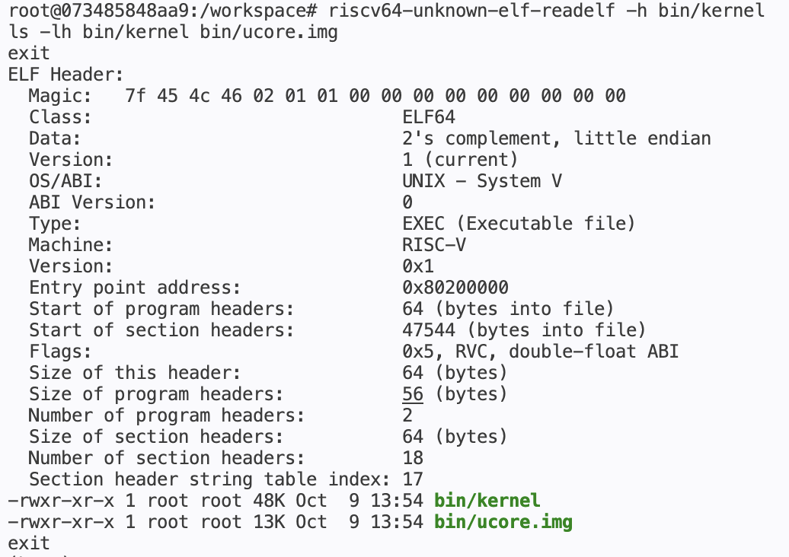
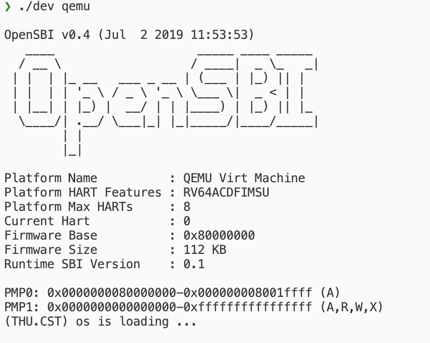
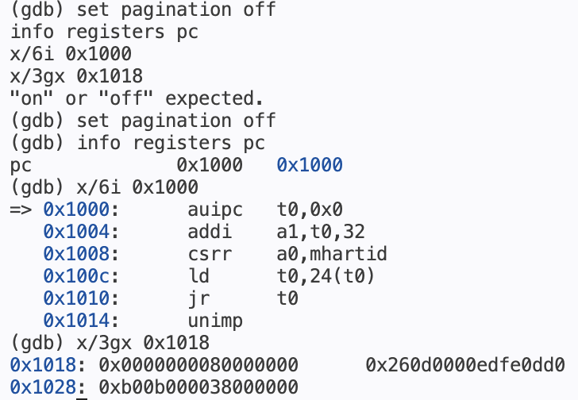
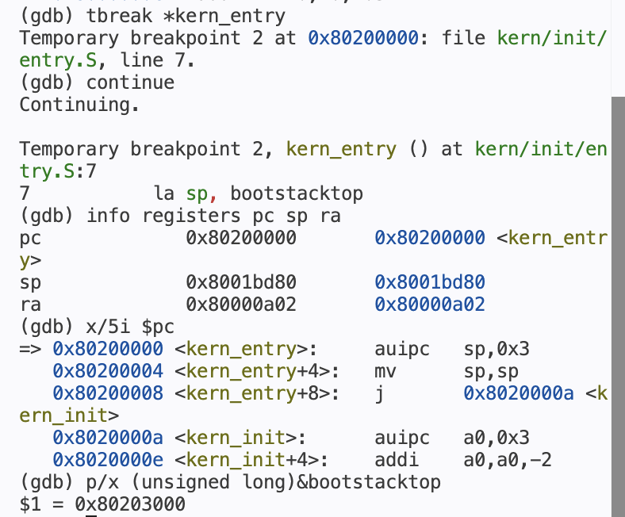
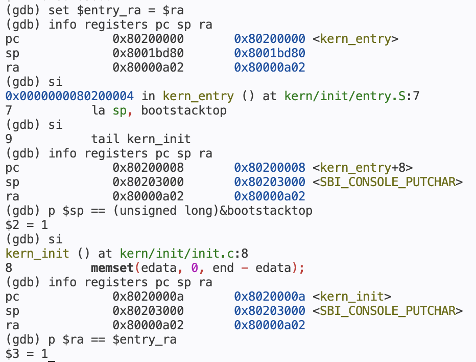

# 操作系统实验报告

## 实验基本信息

| 项目 | 内容 |
|------|------|
| **实验名称** | Lab 1：最小可执行内核与启动流程 |
| **小组成员** | 2412439-崔迪、2412819-李子谦、2412852-梁靖泽 |
| **完成日期** | 2026-10-09 |

### 小组分工

本次实验采用共同学习、共同讨论的方式。三位成员均完整阅读并理解了 Lab 1 的实验指导和相关源代码，包括内存布局、链接脚本、内核入口、SBI 输出接口及 QEMU/GDB 启动与调试流程。两个练习由全组共同分析，报告内容共同讨论、核对与整理。

**练习与模块分工**

| 成员 | 负责的练习/模块 |
|------|----------------|
| 2412439-崔迪 | 阅读全部实验内容，共同分析练习 1、练习 2 及各核心模块 |
| 2412852-梁靖泽 | 阅读全部实验内容，共同分析两个练习，重点核对指导书要求、实验环境与验证结果 |
| 2412819-李子谦 | 阅读全部实验内容，共同分析练习 1、练习 2 及各核心模块 |

**实验报告分工**

| 成员 | 实验报告分工 |
|------|----------------|
| 2412439-崔迪 | 共同整理启动逻辑、练习答案、测试结果与实验总结 |
| 2412852-梁靖泽 | 整理个人环境与工具信息，核对报告和指导书要求的一致性，并共同审阅报告 |
| 2412819-李子谦 | 共同整理启动逻辑、练习答案、测试结果与实验总结 |

---

## 一、实验目的

本实验的主要目的是：

1. 理解 QEMU 模拟的 RISC-V 计算机从复位 ROM、OpenSBI 到内核入口的控制权移交过程。
2. 理解链接脚本如何安排内核各段、确定入口与加载地址，以及 ELF 文件与原始二进制镜像的用途。
3. 理解内核入口汇编如何建立栈环境，并转入 C 语言初始化函数。
4. 理解内核如何通过 SBI 服务完成字符输出，并逐层封装为格式化输出接口。
5. 使用交叉编译工具链构建内核，使用 QEMU 运行，并使用 GDB 观察启动地址和寄存器变化。

Lab 1 已提供最小内核的实现。本次实验围绕入口代码分析和启动流程调试完成两个必做练习，代码调整集中在开发环境与调试工具配置。

---

## 二、实验环境

**AI 编程工具与底层模型**

小组成员使用的 AI 编程工具与底层模型如下，主要用于辅助代码阅读、环境配置和报告整理。

| 成员 | AI 编程工具 | 底层模型 | 备注 |
|------|------------|----------|------|
| 2412439-崔迪 | Claude Code | deepseek-v4-flash | — |
| 2412852-梁靖泽 | Claude Code | deepseek-v4-flash | — |
| 2412819-李子谦 | Claude Code | deepseek-v4-flash | — |

**说明：**

- **AI 编程工具**：指具体使用的终端工具、编辑器插件、桌面应用或浏览器界面。
- **底层模型**：指该工具使用的大语言模型及版本。

**开发与运行环境**

三位成员的开发环境分别记录如下。macOS 使用 Ubuntu Docker 容器，Windows 使用 WSL2；第五章的启动截图展示 OpenSBI v0.4 环境的运行结果。

**成员 1：崔迪**

| 项目 | 实际环境 |
|------|----------|
| 宿主机 | macOS，Apple Silicon / ARM64 |
| 容器系统 | Ubuntu 22.04，aarch64 |
| RISC-V 编译器 | riscv64-unknown-elf-gcc 10.2.0 |
| RISC-V binutils | 2.35.1 |
| 构建工具 | GNU Make 4.3 |
| 模拟器 | QEMU 4.1.1，`virt` 机器 |
| 调试器 | gdb-multiarch 12.1 |
| 实际启动固件 | QEMU 内置 OpenSBI v0.4，运行时 SBI 版本 0.1 |
| 内核链接与启动地址 | `0x80200000` |
| 版本管理 | Git，GitHub 仓库的 `lab1` 分支 |

**成员 2：梁靖泽**

| 项目 | 实际环境 |
|------|----------|
| 宿主机 | Windows，WSL2，x86_64 |
| Linux 系统 | Ubuntu 22.04，x86_64 |
| RISC-V 编译器 | riscv64-unknown-elf-gcc 15.1.0 |
| RISC-V binutils | 2.45 |
| 构建工具 | GNU Make 4.3 |
| 模拟器 | QEMU 4.1.1，`virt` 机器 |
| 调试器 | riscv64-unknown-elf-gdb 16.3.90.20250610-git |
| 实际启动固件 | QEMU 内置 OpenSBI v1.0，运行时 SBI 版本 0.3 |
| 内核链接与启动地址 | `0x80200000` |
| 版本管理 | Git，GitHub 仓库的 `lab1` 分支 |

**成员 3：李子谦**

| 项目 | 实际环境 |
|------|----------|
| 宿主机 | Windows，WSL2，x86_64 |
| Linux 系统 | Ubuntu 24.04.4 LTS，x86_64 |
| RISC-V 编译器 | riscv64-unknown-elf-gcc 10.2.0 |
| RISC-V binutils | 2.35 |
| 构建工具 | GNU Make 4.3 |
| 模拟器 | QEMU 4.1.1，`virt` 机器 |
| 调试器 | riscv64-unknown-elf-gdb 10.1 |
| 实际启动固件 | QEMU 内置 OpenSBI v0.4，运行时 SBI 版本 0.1 |
| 内核链接与启动地址 | `0x80200000` |
| 版本管理 | Git，GitHub 仓库的 `lab1` 分支 |

---

## 三、实验整体逻辑分析

### 3.1 本章节的逻辑主线

本章解决的问题是：在尚无完整操作系统、标准 C 库和进程运行环境时，如何让一个最小内核得到 CPU 控制权，并输出启动信息。

首先通过链接脚本确定内核布局与入口，保证镜像中的代码和链接时使用的地址一致；随后通过 QEMU 和 OpenSBI 建立启动环境并移交控制权；进入内核后，汇编代码设置栈，C 代码初始化零数据区域，并通过自定义输出接口调用 SBI 服务。最后使用 GDB 对这一流程进行验证。

本实验的执行链为：

```text
QEMU 准备固件、内核镜像及设备树
  → CPU 从复位 ROM 0x1000 开始执行
  → 跳转到 OpenSBI 0x80000000（M 模式）
  → OpenSBI 初始化并移交控制权
  → 进入 kern_entry 0x80200000（S 模式）
  → 设置内核栈，跳转 kern_init
  → 清零 .bss，输出启动信息
  → 进入无限循环
```

镜像准备与 CPU 执行是两个不同阶段。在本次 QEMU 配置下，QEMU 在 CPU 开始执行前将内核装入内存，OpenSBI 完成初始化后向内核移交控制权。

### 3.2 功能的逐步实现

1. **安排内存布局。** 链接脚本确定代码、只读数据、已初始化数据和零初始化数据的位置，为内核入口提供确定地址。
2. **建立执行环境。** QEMU 模拟硬件，OpenSBI 完成机器态初始化，为进入 S 模式内核提供条件。
3. **建立 C 函数调用所需的栈。** `entry.S` 设置 `sp`，随后将执行流交给 `kern_init()`。
4. **初始化与输出。** `kern_init()` 清理零数据区域，通过格式化输出链调用 SBI，显示启动成功的信息。
5. **验证执行路径。** 通过 ELF 符号、反汇编、断点和寄存器值，核对实际执行是否符合代码分析。

---

## 四、实验内容与实现

### 功能模块：最小内核启动与格式化输出

**负责人：** 2412439-崔迪、2412852-梁靖泽、2412819-李子谦

#### 模块功能描述

**核心函数与接口：**

以下为初始代码中涉及的主要接口：

```c
int kern_init(void) __attribute__((noreturn));
int cprintf(const char *fmt, ...);
int vcprintf(const char *fmt, va_list ap);
void cons_putc(int c);
void sbi_console_putchar(unsigned char ch);
uint64_t sbi_call(uint64_t sbi_type,
                  uint64_t arg0, uint64_t arg1, uint64_t arg2);
```

**功能说明：**

**内存布局与内核初始化**

`tools/kernel.ld` 使用 `OUTPUT_ARCH(riscv)` 指定目标架构，使用 `ENTRY(kern_entry)` 指定 ELF 入口，并将布局计数器设置为 `0x80200000`。其主要安排如下：

| 段或符号 | 作用 |
|----------|------|
| `.text` | 存放可执行指令 |
| `.rodata` | 存放只读常量，如启动字符串 |
| `.data`、`.sdata` | 存放已初始化的可写数据，本实验的启动栈也预留在 `.data` 中 |
| `.bss` | 存放需要零初始化的数据 |
| `edata`、`end` | 标识已初始化数据末端与零数据区域末端，供清零操作使用 |

`. = ALIGN(0x1000)` 将当前位置向上对齐到 4096 字节的整数倍，使数据段起始地址满足 4 KiB 对齐要求。

构建生成的 `bin/kernel` 是带符号和调试信息的 ELF 文件，供 GDB 使用。`objcopy --strip-all -O binary` 将其转换为原始镜像 `bin/ucore.img`，供 QEMU 加载。原始镜像不含 ELF 入口元数据；`.bss` 表示零初始化数据区域，其清零由内核代码完成。

`kern_init()` 首先调用 `memset(edata, 0, end - edata)` 清理零初始化区域，然后通过 `cprintf()` 输出启动信息，最后进入无限循环。使用的头文件和函数来自实验自身的基础库。

**SBI 与格式化输出**

输出过程为：

```text
cprintf
  → vcprintf
  → vprintfmt
  → cputch
  → cons_putc
  → sbi_console_putchar
  → sbi_call
  → ecall
  → OpenSBI 控制台服务
```

`cprintf()` 管理可变参数，`vprintfmt()` 解析格式字符串并逐个产生字符；`cputch()` 调用控制台接口并统计字符数。最底层的 `sbi_call()` 通过内联汇编设置参数并执行 `ecall`。

本实验使用旧式 SBI 控制台接口，将服务编号放入 `a7`，参数放入 `a0` 等寄存器，字符输出编号为 1。内核运行在 S 模式，通过环境调用异常请求 OpenSBI 的 M 模式服务，处理完成后继续执行内核。`ecall` 的异常处理目标由特权配置与异常委托决定。


#### 环境适配与问题解决

本次实验沿用课程提供的入口汇编、初始化函数和输出库，通过 Docker 配置及本地构建目标完成编译、运行和调试环境的适配。原始 `Makefile` 的启动与调试目标保持原有配置，Docker 环境使用 `environment/Makefile.local` 中的本地目标，具体调整如下：

| 改动 | 原因与结果 |
|------|------------|
| 添加 Dockerfile、Compose 配置和 `code/dev` | 在 Ubuntu 容器中统一编译、运行与调试工具 |
| 在 `environment/Makefile.local` 中添加 `local-qemu` 和 `local-debug` | 使用 `-kernel $(UCOREIMG)` 加载镜像，调试目标同时添加 `-s -S` |
| 添加 `local-gdb` 目标 | 使用容器中的 `gdb-multiarch` 加载 ELF 符号并连接 QEMU |
| 添加 `environment/verify.sh` | 自动检查 ELF 入口、启动输出和三个关键地址断点 |
| 在 Dockerfile 中固定 QEMU 4.1.1 | 通过源码构建统一模拟器版本，最终启动结果见第五章截图 |

环境适配阶段曾使用 QEMU 6.2.0 与 OpenSBI v0.9。最初编译成功，但启动只显示固件信息；日志中 `Domain0 Next Address` 为零。改用本地目标中的 `-kernel` 参数后，内核成功输出启动字符串，GDB 也命中入口断点。该阶段的验证结果保存在 `environment/verification.txt`。最终 Docker 配置固定为 QEMU 4.1.1，本次截图记录了 OpenSBI v0.4 环境下的启动与单步调试结果。

Docker 环境在 `code/` 目录中通过 `./dev build` 编译、`./dev qemu` 运行；交互调试时，在两个终端分别执行 `./dev debug` 和 `./dev gdb`。

---

### 练习：练习 1——理解内核启动中的程序入口操作

**负责人：** 2412439-崔迪、2412852-梁靖泽、2412819-李子谦

入口代码的关键部分为：

```asm
kern_entry:
    la sp, bootstacktop
    tail kern_init
```

#### （1）`la sp, bootstacktop` 完成什么操作，目的是什么？

`la` 是加载符号地址的伪指令。该指令将 `bootstacktop` 的地址写入栈指针 `sp`，并非读取栈顶地址处的内存内容。

代码通过 `.space KSTACKSIZE` 为启动栈预留空间。`KSTACKPAGE = 2`，页大小为 4096 字节，因此启动栈大小为 8192 字节。`bootstack` 表示低地址边界，`bootstacktop` 表示高地址边界；栈向低地址增长，空栈初始指针应位于高地址端。

进入 C 函数前必须设置有效栈，因为函数调用、保存寄存器和局部变量可能使用栈。沿用固件的栈会让内核依赖固件的私有内存状态。

当前 ELF 的实测符号地址为：

```text
bootstack    = 0x80201000
bootstacktop = 0x80203000
```

当前反汇编中，这条伪指令展开为：

```asm
0x80200000: auipc sp, 0x3
0x80200004: mv    sp, sp
```

第一条指令以自身 PC 为基准加上 `0x3000`，得到 `0x80203000`。第二条是零偏移加法的反汇编别名，本例无需进一步调整地址。具体展开与链接结果有关，不能把该形式视为所有 `la` 的固定展开。

本次截图中，执行这两条机器指令后，`sp` 从固件留下的 `0x8001bd80` 变为 `0x80203000`，与 `bootstacktop` 的地址一致。

#### （2）`tail kern_init` 完成什么操作，目的是什么？

`tail` 是尾调用伪指令，将执行流转到 `kern_init`，同时不为这次转移写入新的返回地址。普通调用通常更新 `ra`，以便被调用函数返回；这里内核初始化函数声明为 `noreturn`，入口代码也不需要重新获得控制权，因此使用尾调用。

当前链接结果将其缩短为跳转：

```asm
0x80200008: j 0x8020000a <kern_init>
```

单步执行后，PC 变为 `0x8020000a`，进入 C 初始化函数，`ra` 仍为此前的 `0x80000a02`。截图中保存跳转前的 `ra`，并在跳转后比较，结果为 1，说明转移没有建立新的返回地址。栈环境的建立由前面的 `la` 完成，`tail` 负责控制流转移。

---

### 练习：练习 2——使用 GDB 验证启动流程

**负责人：** 2412439-崔迪、2412852-梁靖泽、2412819-李子谦

本次交互调试使用 OpenSBI v0.4，运行时 SBI 版本为 0.1。以下复位指令、启动数据和寄存器值均取自第五章的测试截图；环境适配阶段的 OpenSBI v0.9 日志另用于记录固件入口断点验证。

#### 调试过程

QEMU 使用 `-S` 在启动时暂停 CPU，使用 `-s` 提供 1234 端口的 GDB 服务。GDB 加载 `bin/kernel` 中的符号后连接 QEMU，通过以下命令观察复位代码、入口断点和寄存器变化：

```text
(gdb) set pagination off
(gdb) info registers pc
(gdb) x/6i 0x1000
(gdb) x/3gx 0x1018
(gdb) tbreak *0x80000000
(gdb) c
(gdb) info registers pc
(gdb) tbreak *kern_entry
(gdb) c
(gdb) info registers pc sp ra
(gdb) x/5i $pc
(gdb) p/x (unsigned long)&bootstacktop
(gdb) set $entry_ra = $ra
(gdb) si
(gdb) si
(gdb) info registers pc sp ra
(gdb) p $sp == (unsigned long)&bootstacktop
(gdb) si
(gdb) info registers pc sp ra
(gdb) p $ra == $entry_ra
```

关键观察结果如下，固件入口断点取自环境适配阶段的验证日志，其余结果均有本次截图记录：

| 阶段 | PC | 观察 |
|------|----|------|
| 复位暂停 | `0x1000` | 尚未执行内核，位于 QEMU 复位 ROM |
| 固件入口断点（环境适配日志） | `0x80000000` | 开始执行 OpenSBI；本次启动截图中的 Firmware Base 也为该地址 |
| 内核入口断点 | `0x80200000` | 停在 `kern_entry`，尚未初始化内核栈 |
| 栈设置完成 | `0x80200008` | `sp = 0x80203000`，下一步执行 tail |
| 转入 C 入口 | `0x8020000a` | 进入 `kern_init`，本次跳转没有改变 `ra` |

#### 加电后最初的指令位于什么地址，完成什么功能？

本实验使用的 QEMU `virt` 机器从 `0x1000` 开始执行复位 ROM。该地址属于 QEMU 的机器实现，不是所有 RISC-V 硬件都必须采用的统一复位地址，也不是 OpenSBI 自身的入口。

本次截图中，复位 ROM 最初实际执行的五条指令为：

```asm
0x1000: auipc t0, 0x0
0x1004: addi  a1, t0, 32
0x1008: csrr  a0, mhartid
0x100c: ld    t0, 24(t0)
0x1010: jr    t0
```

其作用依次为：

1. `auipc` 建立相对复位代码位置的地址基准，本例 `t0 = 0x1000`。
2. 设置 `a1 = 0x1020`，将复位 ROM 中设备树数据的地址传给固件。
3. 读取当前硬件线程编号 `mhartid`，放入 `a0`。
4. 从 `0x1018` 读取固件入口地址，放入 `t0`；本次实测为 `0x80000000`。
5. 跳转到 `t0` 指定的固件入口，开始执行 OpenSBI。

截图使用 `x/6i 0x1000`，因此还显示 `0x1014: unimp`。CPU 已在 `0x1010` 跳转到固件，不会顺序执行这条反汇编结果。

对 `0x1018` 开始的内存读取结果为：

```text
0x1018: 0x0000000080000000  0x260d0000edfe0dd0
0x1028: 0xb000000038000000
```

`0x1018` 存放固件入口地址，`0x1020` 开始存放设备树头数据。这些内容属于启动数据，分析复位流程时需与前面的可执行指令区分。

OpenSBI 随后完成机器态初始化，将控制权移交给 `0x80200000` 的 S 模式内核。本次 `kern_entry` 断点直接验证了内核开始执行；环境适配阶段的日志也记录了 `Domain0 Next Address = 0x80200000` 和 `Domain0 Next Mode = S-mode`。

#### 关于观察内核加载的说明

指导书建议使用 `watch *0x80200000` 观察内核加载。在本实验的 QEMU 启动方式下，镜像在 CPU 执行之前已被装入内存，连接 GDB 后设置观察点难以捕捉这次装载。因此，本实验通过入口断点与反汇编验证控制权移交过程。

---


## 五、测试与验证

**构建验证**

交叉编译生成 `bin/kernel` 和 `bin/ucore.img`，ELF 检查结果为：

```text
Class:               ELF64
Machine:             RISC-V
Entry point address: 0x80200000
```

**运行验证**

本次 QEMU 启动截图中的关键输出为：

```text
OpenSBI v0.4 (Jul  2 2019 11:53:53)
Firmware Base       : 0x80000000
Runtime SBI Version : 0.1
(THU.CST) os is loading ...
```

内核输出后进入 `kern_init()` 中的无限循环。交互运行使用 QEMU 退出组合键结束；环境验证脚本使用 `timeout` 在限定时间后结束模拟器进程。

**调试验证**

本次 GDB 截图验证了复位 ROM、内核入口、栈指针初始化及转入 `kern_init` 的过程。环境适配阶段的 [验证记录](../code/environment/verification.txt) 使用 QEMU 6.2.0 与 OpenSBI v0.9，另记录了复位 ROM、OpenSBI 和内核入口三个阶段。

| 检查项目 | 结果 |
|----------|------|
| 交叉编译与 ELF 入口检查 | 通过 |
| QEMU 启动字符串 | 通过 |
| GDB 复位地址与内核入口断点 | 通过，本次截图记录 |
| GDB 固件入口断点 | 通过，环境适配日志记录 |
| 栈指针初始化与尾调用单步观察 | 通过 |
| `make grade` | 未执行：本实验代码未提供 `tools/grade.sh`，验证采用 ELF 检查、QEMU 启动及 GDB 调试 |

**测试截图：**

以下五张截图分别记录构建产物、内核启动和 GDB 调试结果。

**图 1：构建产物与 ELF 入口检查。** `bin/kernel` 为 ELF64、RISC-V 可执行文件，入口为 `0x80200000`；文件列表显示 `bin/kernel` 与 `bin/ucore.img` 均已生成。



**图 2：OpenSBI 与内核启动输出。** 本次固件为 OpenSBI v0.4，运行时 SBI 版本为 0.1；终端成功输出 `(THU.CST) os is loading ...`。



**图 3：复位地址、指令及启动数据。** PC 停在 `0x1000`，反汇编显示复位代码，`0x1018` 存放固件入口地址 `0x80000000`。



**图 4：内核入口断点与反汇编。** GDB 命中 `kern_entry`，PC 为 `0x80200000`；初始 SP 为 `0x8001bd80`、RA 为 `0x80000a02`，`bootstacktop` 地址为 `0x80203000`。



**图 5：栈初始化与尾调用验证。** 两次单步后 SP 为 `0x80203000`，与 `bootstacktop` 地址的比较结果为 1；再单步进入 `kern_init`，PC 为 `0x8020000a`，RA 保持 `0x80000a02`，与跳转前保存值的比较结果也为 1。



---

## 六、实验总结与收获

### 对操作系统的理解

**1. 实验知识点与 OS 原理的联系**

| 实验知识点 | 对应 OS 原理 | 联系与差异 |
|------------|-------------|------------|
| 复位 ROM、OpenSBI、内核入口 | 启动与引导 | 体现逐层建立环境和移交控制权；本实验由 QEMU 预装镜像，未实现真实磁盘引导与文件系统读取 |
| 链接脚本与内存段布局 | 程序装载与运行时内存布局 | 通过确定的物理地址组织代码和数据；本实验尚未通过虚拟内存为进程提供独立地址空间 |
| 内核启动栈与 tail | 调用约定与执行上下文 | 栈是 C 代码调用机制的重要基础；本次仅有一个启动栈，没有线程上下文切换 |
| `.bss` 初始化 | 程序运行环境建立 | 零初始化不是简单依赖宿主系统自动完成，内核需自行承担相应职责 |
| SBI 与 ecall | 特权级、异常和受控服务调用 | 通过受控接口请求更高特权级服务；本次为 S 模式内核请求 M 模式固件服务，尚未实现用户程序系统调用 |
| QEMU/GDB 调试 | 可观察性与故障定位 | 将源代码假设与实际 PC、寄存器、反汇编对照，验证固件和内核之间的边界 |

**2. 重要但尚未涉及的 OS 原理知识**

本章尚未实现物理内存分配器、页表与虚拟内存、进程和线程管理、CPU 调度、完整中断处理、用户态系统调用、同步互斥、文件系统及磁盘驱动。最小内核只有启动与输出能力，还不具备通用操作系统管理应用程序和资源的完整功能。

### AI 协作开发的经验

本次协作中，AI 帮助我们梳理入口汇编、链接脚本和输出调用链，并整理了环境配置与调试步骤。最终结论通过源代码、ELF 信息、启动输出和寄存器变化逐项核对。例如，编译生成镜像后，QEMU 曾只输出固件信息；检查 OpenSBI 的下一阶段地址后，我们定位了启动参数问题，并通过启动字符串和入口断点验证了修正结果。

调试还使我们认识到，伪指令的实际展开取决于编译和链接结果，固件版本也会影响复位代码及初始寄存器值。我们以本次 ELF 的反汇编和实测截图解释 `la` 与 `tail`，分别记录环境适配日志和最终调试数据，使源码分析与验证结果相互对应。

**参考资料：**

- 课程本地指导书：Lab 0 环境搭建、Lab 1 全章及报告要求。
- 本仓库的入口汇编、初始化代码、链接脚本、输出库及验证记录。
- [RISC-V Assembly Programmer's Manual](https://github.com/riscv-non-isa/riscv-asm-manual/blob/main/src/asm-manual.adoc)：伪指令含义参考。
- [QEMU virt 平台文档](https://www.qemu.org/docs/master/system/riscv/virt.html)：固件与内核启动方式参考。
- [QEMU Generic Loader 文档](https://www.qemu.org/docs/master/system/generic-loader.html)：启动时装载机制参考。

---
